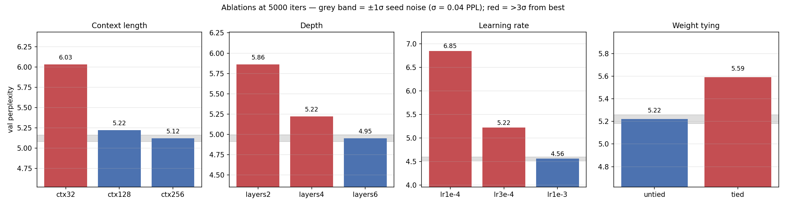
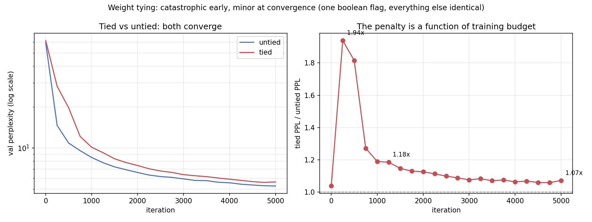

# Transformer From Scratch — the Baseline and the Measurement Protocol

Any claim that an architectural change helps needs a baseline it is measured
against, and a way of deciding whether a difference from that baseline is real
or is just seed noise. This project builds both: a decoder-only Transformer
implemented from primitives, and the seed-based measurement protocol used to
judge every ablation run on it.

📄 **[Technical report (PDF)](report.pdf)** — 4–5 pages: full experimental detail, statistics, and limitations.

## What is implemented by hand

No `nn.MultiheadAttention`, no `nn.TransformerDecoder`, no `transformers`:

- **Causal multi-head self-attention** — explicit `QK^T / √d_k` with a
  lower-triangular mask, so position *i* attends only to positions ≤ *i*
- **Sinusoidal positional encoding** — alternating sine/cosine at
  geometrically increasing wavelengths per dimension
- **Pre-norm residual blocks** (`LayerNorm → sublayer → add`; normalising
  before the sublayer rather than after is more stable to train at depth)
- **Position-wise feed-forward** (GELU, 4× expansion)
- **Optional weight tying** (`--tie_weights`) — shares the
  embedding matrix with the output projection, saving `vocab_size × d_model`
  parameters

The point is not that these are hard. It is that every matrix multiply in the
forward pass, the causal mask, and the loss are inspectable and modifiable —
which is what makes it possible to replace attention internals that a
higher-level library would hide.

## Dataset

Tiny Shakespeare (~1.1M characters, fetched from
[karpathy/char-rnn](https://github.com/karpathy/char-rnn)), 90/10 split,
**character-level** (vocab 65). Character-level keeps this project about the
Transformer architecture itself rather than about tokenization design.

## Confirmed baseline

`d_model=128, n_heads=4, n_layers=4, block_size=128, batch_size=64, lr=3e-4`,
5000 iterations, **809,984 parameters**:

| Metric | Value |
|---|---|
| Final train loss | 1.5431 |
| Final val loss | **1.6533** |
| Val perplexity | **5.22** |
| Training time | 157.6 s (GPU) |

*(An earlier run of this config predated the `--seed` flag and reported 5.35.
The number above is from `--seed 42` and is the reproducible one; the 0.13 PPL
difference is ~3σ, which the seed study below puts in context.)*

| iter | train | val |
|---|---|---|
| 1 | 4.1827 | 4.0840 |
| 1000 | 2.1782 | 2.1429 |
| 2000 | 1.8744 | 1.8889 |
| 3000 | 1.7467 | 1.7799 |
| 4000 | 1.6180 | 1.7148 |
| 5000 | 1.5431 | **1.6607** |

Validation loss tracks training loss throughout with no divergence — at this
model and corpus size, 5000 iterations is not yet in the overfitting regime.

## What the model learned, and what it did not

All samples below are from the **same checkpoint whose numbers are reported
above** (`--seed 42`, val PPL 5.22), prompted with `"ROMEO:"`, 250 tokens.
`generate.py` fixes the sampling seed *per temperature*, so differences between
the three are caused by temperature and not by sampling noise.

**temperature 0.7**

> ROMEO: Far a which this send to me distress, / Seposes to her forget with a
> pawise.
> **KING RICHARD III:** My lord, and the comfold contents of his soul, / Than
> they last have me made the deads heart: / His wordship as in my writh of
> sovereign to me?
> **PRINCE EDWARD:**

**temperature 1.0**

> ROMEO: Far a which this servantaged that do keep: / There's counten-consess
> pitise.
> **KING RICHARD III:** Make could, be ever followern England, / And that saw
> the reshall prompemage not shall here / To-forwuness can eyes crown, what new
> even thou that?
> **MENENIUS:**

**temperature 1.3**

> ROMEO: Faunder nobles'd tell duke, distand he, / Yourse, and them of
> Angellapford's I I say. Of pretitle. Go, if inded it dielderman, / As he
> posbrother's wretgurl hath prompimes, / And shoult do win-forwunors canse
> wilt with yours?
> **LARTIUS:** Bette's my lord.

### Quantifying it

Checking every generated word against the corpus's 12,631 distinct word forms:

| temperature | words | real | invented | invented rate |
|---|---|---|---|---|
| 0.7 | 48 | 42 | 6 | **12.5%** |
| 1.0 | 41 | 33 | 8 | **19.5%** |
| 1.3 | 41 | 25 | 16 | **39.0%** |

Invented-word rate roughly **triples** from 0.7 to 1.3. Because the sampling
seed is held fixed across the three, the divergence point is also measurable:
0.7 and 1.0 share their first **19 characters** before splitting, while 1.3
splits after **2**. Higher temperature does not merely add noise at the end —
it moves the first divergence almost to the start.

### The interesting part: what does *not* degrade

Every speaker label the model produced is a real character from the corpus —
`KING RICHARD III`, `PRINCE EDWARD`, `MENENIUS`, `LARTIUS` — **including at
temperature 1.3**, where 39% of ordinary words are fabricated. All four were
checked against the 1,920 speaker labels appearing in the text.

So the failure is not uniform across the model's outputs. Discourse structure
(who speaks, the `NAME:` + newline format, capitalisation, line breaks) holds
under sampling pressure that lexical content collapses under. A character-level
model with no notion of "word" or "speaker" has learned these as separable
things, and they have different tolerances to entropy.

### What is genuinely learned, and what is not

**Learned.** The invented words are the strongest evidence here, not the
weakest. `wordship`, `servantaged`, `pretitle`, `posbrother's`, `dielderman`
are not English — but every one obeys English morphology and phonotactics:
plausible consonant clusters, real affixes (`-ship`, `-ed`, `pre-`, `-man`),
legal letter sequences throughout. A model with no lexicon has induced what
English words are *permitted to look like*, and it holds that constraint even
while getting the words themselves wrong.

**Not learned.** Sentence-level meaning. `"His wordship as in my writh of
sovereign to me?"` is locally well-formed in every 2–3 word window and globally
incoherent. The model tracks what is locally likely, not what a sentence is
about.

This is the expected signature of a 0.81M-parameter character-level model on
1.1M characters — and it is what motivates the next three projects, each of
which asks whether a *structural* constraint on attention buys what raw scale
here does not.

## Results

All five axes at 5000 iterations, one hyperparameter varying at a time.

### The noise floor first

Three seeds at the baseline config: **5.22, 5.19, 5.27 → 5.23 ± 0.04 PPL.**

σ = 0.04. Every number below is reported in units of it. As a fraction of the
mean (0.8%) this is a relatively tight floor, so this setup can resolve
comparatively small effects.

### All axes

| axis | config | params | val PPL | vs. baseline | σ | verdict | time |
|---|---|---|---|---|---|---|---|
| **context** | 32 | 0.81M | 6.03 | +0.81 | 20.3 | **real** | 72.5 s |
| | **128** | 0.81M | **5.22** | — | — | baseline | 164.6 s |
| | 256 | 0.81M | 5.12 | −0.10 | 2.5 | marginal | 412.7 s |
| **depth** | 2 layers | 0.41M | 5.86 | +0.64 | 16.0 | **real** | 85.3 s |
| | **4 layers** | 0.81M | **5.22** | — | — | baseline | 164.4 s |
| | 6 layers | 1.21M | 4.95 | −0.27 | 6.7 | **real** | 245.0 s |
| **learning rate** | 1e-4 | 0.81M | 6.85 | +1.63 | 40.8 | **real** | 164.6 s |
| | **3e-4** | 0.81M | **5.22** | — | — | baseline | 164.9 s |
| | 1e-3 | 0.81M | 4.56 | −0.66 | 16.5 | **real** | 164.8 s |
| **weight tying** | **untied** | 0.81M | **5.22** | — | — | baseline | 164.4 s |
| | tied | 0.80M | 5.59 | +0.37 | 9.3 | **real** | 164.4 s |



*Grey band = ±1σ seed noise around the best config in each panel. Red bars are
more than 3σ from it. Only `ctx256` and `layers6` fall inside or near the band
against their own best — everything else is unambiguous.*

### Finding 1 — depth is real and monotonic here

Depth improves monotonically and unambiguously: 5.86 → 5.22 → 4.95, at 16.0σ
and 6.7σ. Both steps clear the noise floor by a wide margin, so — at this
corpus size and this budget — going from 2 to 6 layers is a genuine,
reproducible improvement rather than a configuration that happened to get a
favorable seed.

Worth noting the cost against the benefit: 4→6 layers buys 5.2% lower
perplexity for 49% more parameters and 49% more wall-clock. Real is not the
same as worth it, and the ablation table alone does not settle that
trade-off.

### Finding 2 — the baseline learning rate is mis-tuned

`lr=1e-3` beats the baseline's `3e-4` by 0.66 PPL (16.5σ).

So the headline baseline in this README — 5.22 — is honest but **not** the best
this architecture reaches; 4.56 is, at zero extra cost, since all three LR runs
took the same 165 s. The baseline is left as-is rather than silently re-run at
the better LR, because every ablation here is measured against it and swapping
it retroactively would invalidate the comparisons above.

### Finding 3 — the weight-tying penalty is a function of training budget

Tying costs 0.37 PPL (9.3σ) at 5000 iterations. That is real, and it refutes
the prediction this README made before the run: I expected the penalty to
*mostly vanish* at this vocabulary size, since the tied matrix here is a much
smaller share of total parameters than it would be at a larger vocabulary. It
shrank a lot in relative terms, but it did not vanish.

The more interesting result comes from the loss curves rather than the final
numbers. Computing the tied/untied perplexity ratio at each evaluation step:



| iter | untied PPL | tied PPL | ratio |
|---|---|---|---|
| 250 | 14.65 | 28.40 | **1.94×** |
| 500 | 10.88 | 19.75 | 1.82× |
| 1000 | 8.52 | 10.13 | 1.19× |
| 2000 | 6.61 | 7.44 | 1.13× |
| 3000 | 5.93 | 6.38 | 1.08× |
| 5000 | 5.26 | 5.64 | **1.07×** |

**The penalty decays monotonically from 1.94× to 1.07× — a 12× reduction —
purely as a function of training budget.** Tying does not make the model worse
so much as it makes it *slower to train*, and most of the apparent cost is
early-training transient.

This is measured **within a single project**, on one tokenization, with
everything but the tying flag held fixed — so it carries no
tokenization/budget confound. It demonstrates directly that **an ablation
conclusion can invert with training budget**, and that reporting one budget
without the curve is how ablation tables mislead: read at iteration 250 alone,
tying looks catastrophic; read at 5000, it looks minor.

### Finding 4 — context length has an elbow, and it is past 128

32 → 128 is unambiguous (20.3σ). 128 → 256 improves by only 0.10 PPL (2.5σ,
marginal) while wall-clock rises 2.5× (164.6 s → 412.7 s) from the O(T²)
attention cost — a small, probably real gain that is not worth its
compute cost. Either way the practical answer is the same: **128 is the
right operating point for this corpus.**

Raw tables in `results/<axis>/summary.csv`, per-axis loss curves in
`results/<axis>/loss_comparison.png`, and the two figures above regenerated by
`python make_figures.py`.

## Files

```
model.py            # the architecture, implemented from primitives
data.py             # char tokenizer + tiny-shakespeare loader
train.py            # run_training() factored out of main(); CSV logs, checkpoints
run_experiments.py  # the one-axis-at-a-time ablation runner
evaluate.py         # standard metrics block from a checkpoint or summary.json
plot_results.py     # loss/perplexity curves, single run or overlaid
generate.py         # sampling; multiple temperatures per call, seed-matched
make_figures.py     # regenerates both figures above from results/
```

`generate.py` fixes the sampling seed *per temperature*, which is what makes
the divergence measurement above possible:

```bash
python generate.py --ckpt checkpoints/model_baseline.pt --prompt "ROMEO:" \
    --temperature 0.7 1.0 1.3 --max_new_tokens 250 --seed 42
```

## Reproducing

```bash
pip install -r requirements.txt
python train.py --tag baseline
python run_experiments.py --axis all --max_iters 5000
python evaluate.py --summary checkpoints/summary_baseline.json
python generate.py --ckpt checkpoints/model_baseline.pt --prompt "ROMEO:" \
    --temperature 0.7 1.0 1.3 --max_new_tokens 250 --seed 42
```

Note: the confirmed baseline above predates the `--seed` flag being added, so
re-running `--tag baseline` now (default `--seed 42`) lands close to but not
bit-identical with those numbers. CUDA is also not fully deterministic even
with a fixed seed. Use `--axis seeds` for the mean ± std version of any figure
reported here.

## Scope and honesty

- Character-level perplexity is measured in different units than a subword
  vocabulary's would be, so any comparison to a subword-tokenized model needs
  its own matched run rather than a side-by-side reading of raw numbers.
- One small single-domain corpus. Conclusions describe this regime.
- No FlashAttention, mixed precision, KV-cache, LR schedule, or warmup. Every
  operation is written to be readable, not fast.
- Sampling is temperature + top-k only; no nucleus sampling.
- Ablations vary one axis from a single baseline point, so interaction effects
  (does the best LR shift with depth?) are out of scope.

## Path to something publishable

This project was written up as "a baseline, not a contribution." Finding 3
changes that assessment.

The tied/untied ratio decaying 1.94× → 1.07× over training is a clean,
confound-free demonstration that **an ablation conclusion is a function of
training budget** — measured with everything but one boolean flag held fixed,
directly rather than inferred.

The paper that points at: *"How much of an ablation result is a statement about
the architecture, and how much about the budget you stopped at?"* The minimal
version runs the full grid at 4–5 budgets (250 / 500 / 1k / 2.5k / 5k) × 5
seeds and reports **how many conclusions flip as budget increases**. This
project's own data already supplies one such flip (weight tying: catastrophic
at iteration 250, minor at 5000), which is the seed for the larger claim.

Missing: (i) the intermediate budgets run as a designed sweep rather than read
off a single run's curves; (ii) a second corpus, so the result is not about
Shakespeare; (iii) a second axis (depth or learning rate) swept across the same
budgets, to check whether the flip pattern generalizes beyond weight tying;
(iv) seeds at every budget, since σ almost certainly grows as budget shrinks —
and if it does, that is itself part of the story.

A workshop paper on empirical methodology, and the most defensible thing this
setup can support. The infrastructure to run it is `run_experiments.py` in a
loop over `--max_iters`.
